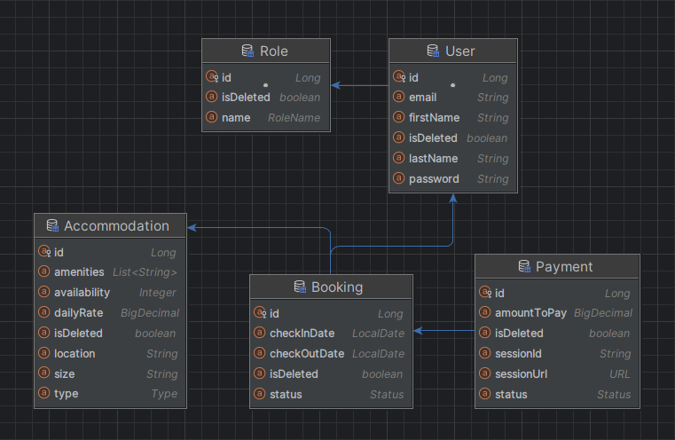
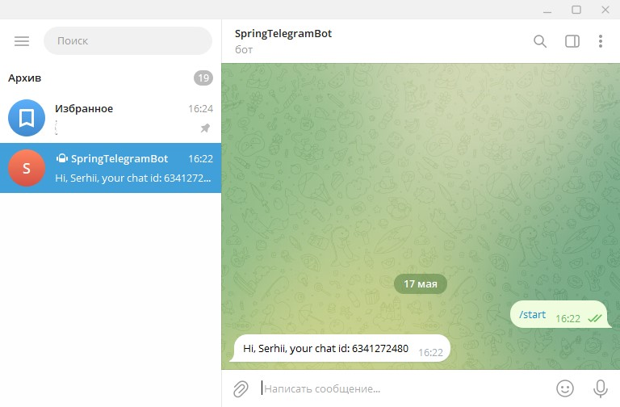

[](icons/booking.jpg)

# Booking service application✈️🏠

Welcome to Booking service application! Our platform is changing
the game in rental procedures, offering a seamless and effective
process for both renters and administrators.
For users, navigating from sign-up to securing their desired
accommodation is simple. Our user-friendly interface provides
comprehensive details about each property, including type,
location, size, amenities, daily rates, and real-time availability.
Administrators benefit from a robust toolkit that simplifies
housing inventory management. Adding, updating, and removing
properties is quick and easy, with instant availability updates.
This is just a glimpse of how our service revolutionizes the
rental experience. Thank you for attention

## Technologies used🛠️

* Spring Boot
* Spring Data JPA
* Spring Boot Security
* JSON Web Token
* Java 17
* Maven
* Lombok
* MapStruct
* Liquibase
* MySql 8
* Hibernate
* JUnit5
* Testcontainers
* Docker
* Docker Compose
* Swagger
* Stripe API
* Telegram API
* Postman

## Entities💾

1. **Booking**: The Booking entity represents a reservation made within the system.
   It includes information such as a unique identifier, check-in and check-out dates, the associated accommodation,
   the user making the booking, booking status, and a soft deletion flag.
2. **Accommodation**: The Accommodation entity holds crucial information about available living spaces.
   It includes details such as accommodation type (e.g., HOUSE, APARTMENT), location, size (e.g., STUDIO, ONE_BEDROOM),
   amenities, daily rental rate, and availability count.
   Soft deletion is implemented, allowing accommodations to be marked as deleted without permanent removal.
   This entity is fundamental to efficiently managing and offering diverse housing options within the system.
3. **User (Customer)**: The user entity represents detailed information about registered users.
   At this stage, there are only 2 roles that grant certain access rights to users, these are: user and admin.
4. **Payment**: The Payment entity encapsulates information about a financial transaction. It includes a unique
   identifier, payment status (e.g., PENDING, PAID),
   associated booking, session URL for payment processing, session ID, payment amount, and a soft deletion flag for
   improved data management.

## Entity relationship diagram📊

[](icons/entity_diagram.png)

## Endpoints🤝

### Authentication Controller:

- **POST /auth/register:** Allows users to register a new account
- **POST /auth/login:** Login with email and password. Response - JWT token

### User Controller:

- **PUT /users/{email}/role/{roleId}:** Allows administrators to update user roles
- **GET /users/me:** Provides profile information for the current user
- **PUT /users/me:** Allows users to update their profile information

### Accommodation Controller:

- **POST /accommodations:** Permits the addition of new accommodations
- **GET /accommodations/all:** Provides a list of available accommodations
- **GET /accommodations/{id}:** Retrieves detailed information about a specific accommodation
- **PUT /accommodations/{id}:** Allows updates to accommodation details
- **DELETE /accommodations/{id}:** Enables the removal of accommodations

### Booking Controller:

- **POST /bookings:** Permits the creation of new accommodation bookings.
- **GET /bookings/?user_id=...&status=...:** Retrieves bookings based on user ID and their status
- **GET /bookings/my:** Retrieves current user's bookings
- **GET /bookings/{id}:** Provides information about a specific booking
- **PUT /bookings/{id}:** Allows users to update their booking details
- **DELETE /bookings/{id}:** Enables the cancellation of bookings

### Payment Controller (Stripe):

- **GET /payments/?user_id=...:** Retrieves payment information for users
- **POST /payments/:** Initiates payment sessions for booking transactions.
- **GET /payments/success/:** Handles successful payment processing through Stripe redirection
- **GET /payments/cancel/:** Manages payment cancellation and returns payment paused messages during Stripe redirection

## How to use the project⚙️

1) Install docker
2) Clone the project from GitHub

```sh
git clone https://github.com/Serhii-Bohatkin/booking-service
```

3) Create an .env file in the root directory. See example in .env-sample file
4) Execute the command

```sh
docker-compose up
```

Now you can use the app with Swagger. Use the port specified in the .env file

```
http://localhost:8081/swagger-ui/index.html
```

or import the Postman collection from the root directory

## Notification Service🔔

Administrators need to start the bot and get a chat ID

[](icons/telegram_screen.jpg)

Then chat IDs need to be specified in the environment variable ${BOT_ALLOWED_CHAT_IDS} separated by commas

## Contact information💬

- [LinkedIn: linkedin.com/in/serhii-bohatkin](https://www.linkedin.com/in/denys-kachalup-358430222/)
- [Telegram: @serhii_bohatkin](https://t.me/serhii_bohatkin)

# Thank you for attention!